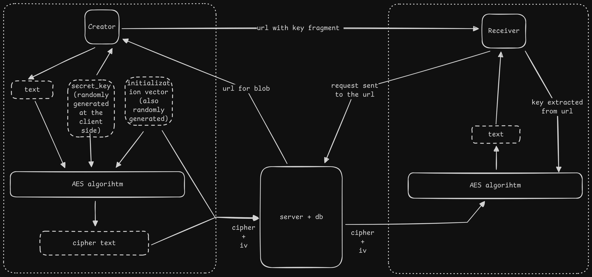
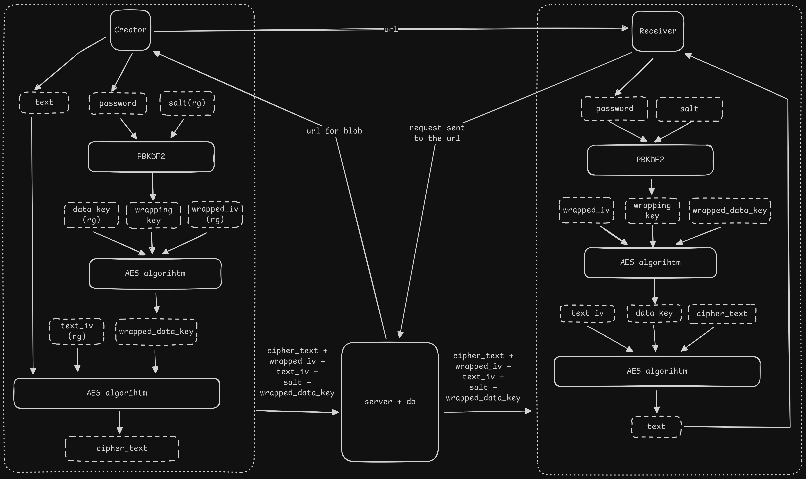

# Vault - Backend Service

[](https://github.com/Sid-op777/vault-backend/actions)
[](https://opensource.org/licenses/MIT)

This repository contains the source code for the Vault backend service. Vault is a zero-knowledge, encrypted snippet-sharing service designed for the secure transmission of sensitive data. This backend is responsible for storing opaque, encrypted blobs and managing their lifecycle based on time-to-live (TTL) and view-count rules.

**View the live project:** [https://vault.nx7.tech](https://vault.nx7.tech)

**Frontend Repository:** `https://github.com/Sid-op777/vault-frontend`

---

## System Architecture and Core Principles

The entire Vault system is designed on a **zero-knowledge** principle. This backend service has no ability to decrypt the data it stores. All cryptographic operations, including key generation and encryption, are performed client-side in the user's browser. The server's sole responsibility is to store an opaque ciphertext blob and its associated metadata, then permanently delete it upon retrieval or expiry.

### Cryptographic Flow

The two primary cryptographic flows are handled entirely by the client application. The backend simply facilitates the storage and retrieval of the resulting ciphertext.

| Password-less Flow (Key in Fragment) |
| :---: |
|  |

| Password-Protected Flow (Key Wrapping) |
| :---: |
|  |


---

## Key Features

- **Stateless REST API:** Provides clean, predictable endpoints for creating, retrieving, and revoking snippets.
- **Atomic Operations:** Utilizes database transactions to ensure that view-limited snippets are safely and atomically retrieved and deleted, preventing race conditions.
- **Secure by Design:** Stores only encrypted data blobs and has no knowledge of the decryption keys used by the clients.
- **Configurable Expiry:** Supports both time-based (TTL) and view-based quotas for snippet self-destruction.
- **Automated Purging:** A background scheduler, implemented with Spring's `@Scheduled` annotation, periodically purges expired snippets from the database.

---

## Technology Stack

[](https://spring.io/projects/spring-boot)
[](https://www.oracle.com/java/)
[](https://www.postgresql.org/)
[](https://restfulapi.net/)
[](https://www.docker.com/)
[](https://maven.apache.org/)


| Component | Technology |
| :--- | :--- |
| Framework | **Spring Boot 3.x** |
| Language | **Java 21** |
| Database | **PostgreSQL** |
| API | **RESTful API over HTTPS** |
| Deployment | **Docker** |
| Build Tool | **Maven** |

---

## Local Development Setup

These instructions will get you a copy of the project up and running on your local machine for development and testing purposes.

### Prerequisites

- Java 21 (or newer)
- Apache Maven
- Docker and Docker Compose

### Installation and Execution

1.  **Clone the repository:**
    ```bash
    git clone https://github.com/Sid-op777/vault-backend.git
    cd vault-backend
    ```

2.  **Create the environment file:**
    This project uses a `.env` file for local configuration. An example is provided.
    ```bash
    cp .env.example .env
    ```
    The default values in this file are configured to work with the `docker-compose.yml` setup.

3.  **Run with Docker Compose (Recommended):**
    This is the simplest method to start the entire backend stack, including the PostgreSQL database.
    ```bash
    docker-compose up --build
    ```
    The API will be available at `http://localhost:8080`.

---

## API Documentation

All endpoints are versioned and prefixed with `/api/v1`.

### `POST /snippet`

Creates a new encrypted snippet.

**Request Body:**
```json
{
  "ciphertext": "string (base64 encoded JSON blob)",
  "passwordProtected": "boolean",
  "expiresAt": "string (ISO 8601 UTC timestamp)",
  "maxViews": "integer (>= 1)"
}
```

**Success Response (201 Created):**
```json
{
  "id": "string (UUIDv7)",
  "revocationToken": "string (URL-safe base64)"
}
```

### `GET /snippet/{id}`

Retrieves an encrypted snippet. This is an atomic operation and will decrement the view count.

**Success Response (200 OK):**
```json
{
  "ciphertext": "string (base64 encoded JSON blob)",
  "passwordProtected": "boolean",
  "expiresAt": "string (ISO 8601 UTC timestamp)",
  "viewsRemaining": "integer"
}
```

**Error Response (410 Gone):**
Returned if the snippet is expired, its view limit is reached, or it has been deleted.

### `DELETE /snippet/{id}`

Manually revokes (deletes) a snippet before its scheduled expiry.

**Query Parameter:**
- `revocation_token` (string, required): The token received during snippet creation.

**Success Response (204 No Content):**
The snippet was successfully found and deleted.

---

## License

This project is licensed under the MIT License. See the [LICENSE](LICENSE) file for details.